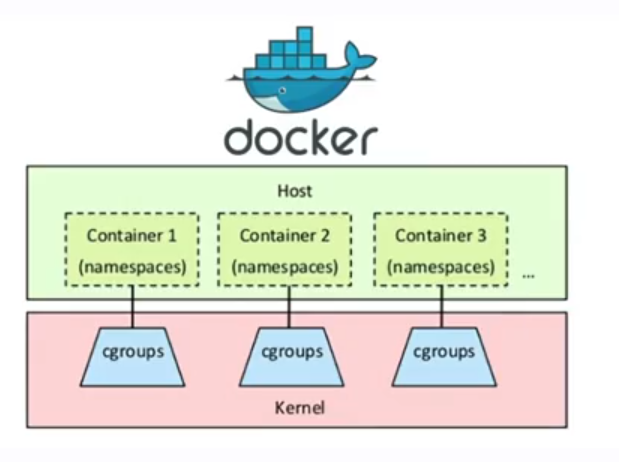

<h3 align="center">
  ⚡ Teoria: Containers
</h3>

### Containers, Docker e LXC

#### O que é um container?

**Ambiente isolado:** Rodar de forma isolada.

**Compartilha um host:** Cada aplicação que tiver é um container. Na prática, se tiver algum container defeituoso, não afetará outras aplicações.

**Contém todos os elementos necessários para rodar a sua aplicação**

**LXC (Linux Containers):** Um recurso nativo que permite executar containers Linux.

> Docker é uma interface e uma das tecnologias que podemos utilizar para construir, publicar e rodar containers.

#### E as máquinas virtuais?

**Tudo roda na mesma máquina:** Se o servidor para de funcionar, tudo para de funcionar.

**Fins diferentes de um container**

**Possui seu próprio SO**

#### Docker

**Interface para lidar com containers:** Surgiu há cerca 15 anos e foi popularizado há 10/11 anos

**Utiliza o kernel do Linux**

**Baseado em imagem:** Facilita a portabilidade. É o binário da aplicação, com todos os recursos.

**Facilita o ciclo de entrega:** não precisa configurar o servidor (ex: instalar php, node, java, etc). Só precisa do servidor em si, e executar o container.

**É level e portátil**

### Principios de isolamento

#### Como funciona?

**CGroups::** Gerenciam recursos como memória, CPU, disco, rede. A ideia é que um container não monopolize os recursos do host.

**Namespaces::** Isolamento de recuros. Sistemas de arquivos, processos e até mesmo rede. O container só consegue enchergar os próprios recursos.

**Unshare:** criar novo namespace para um processo já existentes. Possibilitar a execução de processos em um ambiente isolado sem a necessidade de uma interface de container. Por exemplo, se não tiver usando o docker, poderia usar o unshare para executar o container.

### Open container Initiative (OCI)

#### O que é OCI?

- Estrutura de governança (padrão de mercado a nível de container)

- Visa facilitar a interoperabilidade

- Garante padrões mantendo a flexibilidade

- Runtime; Image; Distro

Olhar o Runc (runtime) como um exemplo de OCI.

#### Objetivos

- Promover containers agnósticos: Não devem estar intimamente vinculados a um fornecedor específico

- Promover portabilidade. Containers devem ser simplesmente transferíveis

### Principais formas de trabalhar com containers

- **Trabalharemos com Docker:** É o mais utilizado e com ótimo desempenho e ótima facilidade na portabilidade.

- Excelente comunidade Docker

- Switch de ferramentas 

### Entendendo mais sobre o Docker

- Imagem é um modelo imutavel somente de leitura e que define como que um container será executado.

- Container é uma instância de uma imagem. Por default é efêmero. Quando o container deixar de existir, todos os dados são perdidos.

