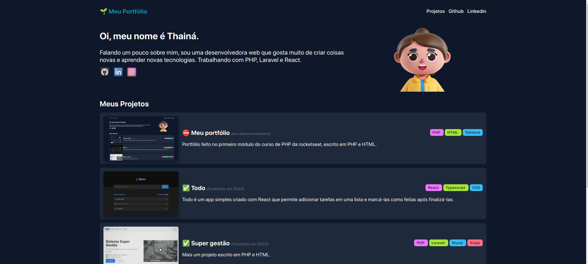

<h3 align="center">
  🗂️ Projeto: Meu portfólio
</h3>

## :rocket: Sobre o projeto

Portfólio de projetos simples.

## :computer: Tecnologias utilizadas

<table>
  <tr>
    <td></td>
    <td></td>
    <td></td>
  </tr>
</table>

### 🔎 Preview:

<p align="center">
  
</p>

### 📌 Como rodar?

```php -S localhost:8888```